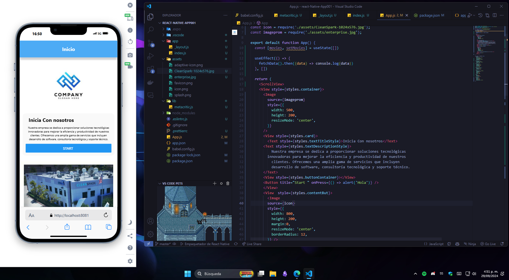

# React Native Projects

Este repositorio contiene una colección de proyectos desarrollados con React Native. Cada carpeta contiene un proyecto diferente que demuestra diversas funcionalidades y características de esta potente plataforma de desarrollo móvil. Puedes usar estos proyectos como referencia para aprender o mejorar tus habilidades en React Native.

## Proyectos

### 1. **Proyecto Uno - Introducción a React Native**
   - **Descripción:** Este es un proyecto básico para familiarizarte con el entorno de desarrollo de React Native. Incluye una simple aplicación que muestra componentes básicos como `View`, `Text`, `Button`, y `Image`. El objetivo es comprender cómo funcionan las vistas, los estilos y la interacción con el usuario.
   - **Características:**
     - Uso de componentes básicos de React Native.
     - Aplicación de estilos mediante el sistema de estilos incorporado.
     - Manejo de eventos simples como `onPress`.
   
  


## Instalación General

Para ejecutar cualquiera de los proyectos:

1. Clona el repositorio:
   ```bash
   git clone https://github.com/usuario/react-native-projects.git
