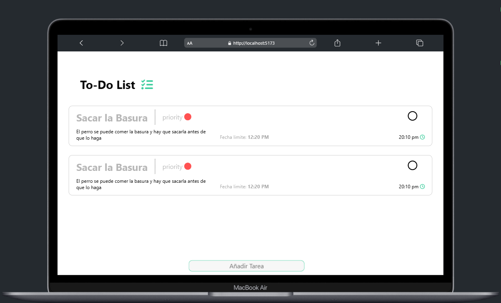

# <h1>To-Do List Application</h1> 

Una aplicación sencilla para gestionar tus tareas diarias de forma eficiente. Agrega, actualiza y elimina tareas con facilidad.

  

## Características

- **Agregar Tareas**  
  Puedes agregar nuevas tareas a tu lista simplemente ingresando el texto en el campo correspondiente.

- **Actualizar Tareas**  
  Para actualizar una tarea existente, simplemente presiona y mantén presionado sobre la tarea que deseas editar. Se abrirá una ventana con las opciones seleccionadas.


- **Eliminar Tareas**  
  Para eliminar una tarea, desliza hacia un lado. Si decides que realmente quieres eliminarla, desliza nuevamente y se eliminará de la lista.

  

## Diseño

La aplicación tiene un diseño intuitivo y fácil de usar. A continuación, puedes ver una captura de pantalla del diseño:


## Instalación

1. Clona el repositorio:
   ```bash
   git clone https://tu-repositorio-url.git
